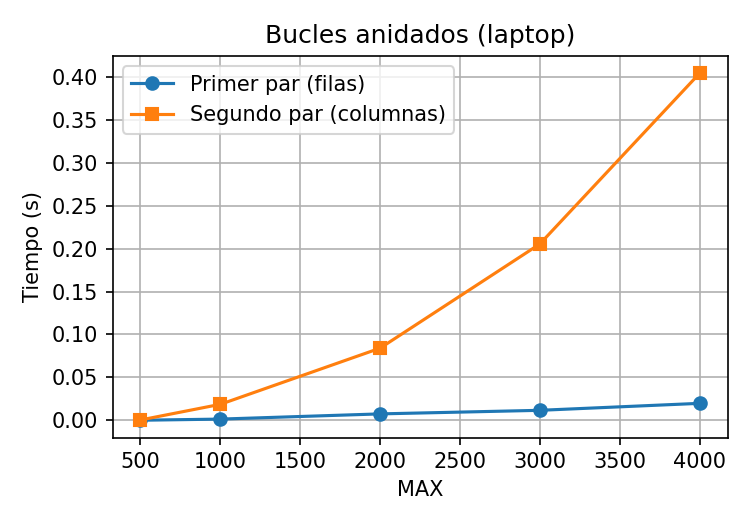
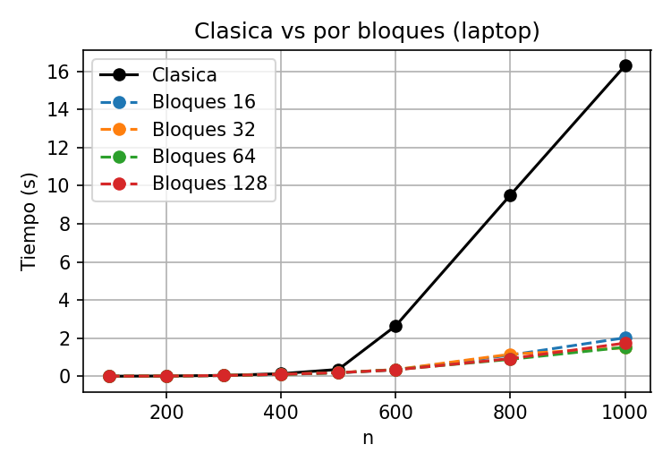

# Lab 2 - Evaluación del desempeño de algoritmos y comportamiento de la memoria caché

Laboratorio del curso donde comparamos algoritmos que tienen **la misma complejidad** pero
**distinta forma de acceder a la memoria**, para ver cuánto influye la caché en el tiempo de ejecución.

Se implementó:

1. Los dos pares de bucles anidados del libro de Pacheco (cap. 2, pág. 22).
2. La multiplicación clásica de matrices (3 bucles).
3. La multiplicación de matrices por bloques (6 bucles).
4. El análisis del acceso a memoria de ambas multiplicaciones.
5. La evaluación con Valgrind (Cachegrind) y KCachegrind.

El informe completo está en [`informe/informe.tex`](informe/informe.tex).

---

## Entorno

Las pruebas se hicieron en dos computadoras, usando en ambas una máquina virtual con Lubuntu.

| | Laptop | PC |
|---|---|---|
| Procesador | Intel i5-3230M (2 núcleos) | Intel i5-10400 (6 núcleos) |
| Caché L1 datos | 32 KB | 32 KB |
| Caché L2 | 256 KB | 256 KB |
| Caché L3 | **3 MB** | **12 MB** |
| Máquina virtual | Lubuntu 16.04 (32 bits), 4 vCPU, 2 GB | igual |
| Compilador | g++ 5.4.0 con `-std=c++14 -O2 -g` | igual |
| Valgrind | 3.11.0 | igual |

Cada caso se ejecutó 3 veces y se usó el promedio.

---

## Resultados principales

### 1. Bucles anidados: filas vs columnas

Los dos pares de bucles hacen las mismas `MAX²` iteraciones, pero recorrer la matriz por columnas es mucho más lento.

| MAX | Laptop: columnas / filas | PC: columnas / filas |
|---|---|---|
| 500 | 2,0 veces más lento | 1,0 |
| 1000 | 11,6 | 2,4 |
| 2000 | 11,0 | 6,9 |
| 4000 | **20,2** | **8,7** |

En la laptop el salto grande ocurre entre 500 y 1000, cuando la matriz (7,6 MB) ya no cabe en L3 (3 MB).
En la PC el salto aparece después porque su L3 es más grande.



### 2. Multiplicación clásica

Es O(n³), así que al duplicar n el tiempo debería multiplicarse por 8. Pero cuando las matrices dejan
de caber en la caché, crece mucho más:

| | De n=500 a n=1000 | Teoría |
|---|---|---|
| Laptop | tiempo × **45,5** | × 8 |
| PC | tiempo × **21,5** | × 8 |

En la laptop, el tiempo por operación pasa de ~2 ns a ~16 ns.

### 3. Multiplicación por bloques

Misma complejidad O(n³), pero mucho más rápida para matrices grandes:

| n = 1000 | Clásica | Bloques (b=32) | Mejora |
|---|---|---|---|
| Laptop | 16,30 s | 1,49 s | **10,9×** |
| PC | 2,80 s | 0,91 s | **3,1×** |

El mejor tamaño de bloque estuvo cerca de 32, que coincide con lo que cabe en L1:
`3 · b² · 8 bytes ≤ 32 KB  →  b ≤ 36`.



### 5. Cachegrind

| Caso | Instrucciones | Fallos D1 | Tasa D1 |
|---|---|---|---|
| Clásica, n=500 | 1 009 millones | 113 millones | 29,9 % |
| Bloques b=32, n=500 | 1 078 millones | **1,9 millones** | **0,5 %** |
| Clásica, n=512 | 1 083 millones | 135 millones | 33,2 % |
| Bloques b=32, n=512 | 1 156 millones | 136 millones | 30,8 % |

- La versión por bloques ejecuta **más** instrucciones pero es más rápida: el tiempo no depende de las instrucciones sino de los fallos de caché.
- Con n=500 los bloques tienen **60 veces menos** fallos en D1.
- **Algo que no esperaba:** con n=512 los bloques casi no mejoran. Pasa porque 512 es potencia de 2: los elementos de una columna de B quedan separados justo 64 líneas de caché, todos caen en el mismo conjunto de D1 (que solo tiene 8 vías) y se expulsan entre ellos.
- En la clásica, la línea `C[i*n+j] += A[i*n+k] * B[k*n+j]` tiene el 99,8 % de los fallos de D1.

### Conclusión

La complejidad solo cuenta operaciones. En la práctica, el orden en que se accede a la memoria
puede hacer que un programa con la misma complejidad sea más de 10 veces más rápido.

---

## Estructura del repositorio

```
.
├── bucles.cpp            Ejercicio 1
├── clasica.cpp           Ejercicio 2
├── bloques.cpp           Ejercicio 3
├── verificar.cpp         Comprueba que bloques da el mismo resultado que la clásica
├── Makefile
├── experimentos.sh       Ejecuta los ejercicios 1-3 y guarda CSV
├── cachegrind.sh         Ejercicio 5
├── graficas.py           Genera las gráficas
├── resultados_laptop/    CSV medidos en la laptop
├── resultados_pc/        CSV medidos en la PC
├── cachegrind_laptop/    Salidas de Cachegrind (laptop)
├── cachegrind_pc/        Salidas de Cachegrind (PC)
├── graficas/             Imágenes generadas
└── informe/              Informe en LaTeX
```

## Cómo compilar y ejecutar

Requisitos: `g++` (C++14), `make`, `valgrind`, `kcachegrind` y Python 3 con `pandas` y `matplotlib`.

```bash
make
./bucles 2000
./clasica 500
./bloques 500 32
```

Verificar la multiplicación por bloques (n=500, b=32):

```bash
g++ -std=c++14 -O2 verificar.cpp -o verificar
./verificar
```

Experimentos completos:

```bash
chmod +x experimentos.sh cachegrind.sh
./experimentos.sh
./cachegrind.sh laptop 512 32     # o: ./cachegrind.sh pc 512 32
```

Gráficas:

```bash
python graficas.py resultados_laptop laptop
python graficas.py resultados_pc pc
```

Ver Cachegrind en modo gráfico:

```bash
kcachegrind cachegrind_pc/clasica_512.out
```

Informe (hay una versión completa y una más sencilla, `informe_simple.tex`):

```bash
cd informe
pdflatex informe.tex
pdflatex informe.tex
```
